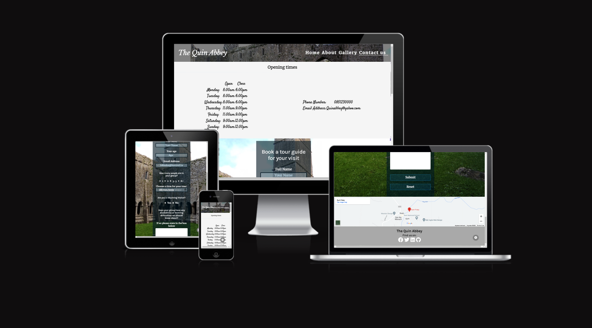

# The Quin Abbey 
**The Quin Abbey** is a old Friary in Quin Village County Clare. I have picked this location because of its history and made a responsive website for it where you can see a 360 video of the Abbey on the home page, there is a about page with history, facts and myths of the Abbey. I have also Added a Gallery with many photos of outside and inside of the Abbey. On the contact page it has Opening times, the location and a form to book a tour a tour guide.

 [View the Quin Abbey live website on Github pages](https://dylanp400.github.io/Quin-abby/index.html)

___ 

# Contents
* [User Experience](#User-Experience-(UX))
  * [Initial Discussion]
  * User Stories

* [Design]
  * [Imagery]
  * [Wireframes]

* [Features]
  * [General Features on Each Page]
  * [Future Implementions] 
  * [Accessibility]

* [Technologies Used]
  * [Languages Used] 

* [Testing] 

* [Credits]
  * [Code Used] 
  * [Content]
  * [Media]
  * [Acknowledgments]  

___

# User Experience (UX)

## Initial Discussion
The Quin Abbey is a Historic location in Quin County Clare. People can come and see the Abbey all year round.

### Key information for this site
* Where you can find the Abbey
* A 360 Ariel view of the Abbey
* A Gallery with over 20 photos
* A sign up form for a tour guide
* Location and Opening Times

## User Stories

### Client goals
* To see the Abbey the minute you open the site.
* For the site to be responsive on PC, Phones and Tablets.
* To see where the Abbey is and how to get there.
* To be allowed to Contact and sign up for a tour guide.
* to see photos of the Abbey before people come along. 

# Imagery
All images were taken by myself.
The 360 Ariel video Was found on youtube and I edited it to take the sound off and make it shorter.

# Wireframes

# Features 

* Navigation bar 
   * Featured on all four pages, the navigation bar is fully responsive and includes links to the Home page, About, Gallery and the Contact page

   * This section will allow the user to easily navigate from page to page across all devices without having to revert back to the previous page via the ‘back’ button.
     * 

* Index page Video 
   * The Index page has a video of the Abbey taken from a drone it shows every part of the Abbey from the sky.
     * 

* About page 
  * The About page has all the information of the Abbey through out the years like owners and restorations.
     * 
   

  * I have also inculded  Myths and Tales that surround the Abbey.

     * 

* Gallery
  * For the Gallery I went out to the Quin Abbey myself and took some photos
     * 
  * I got many photos of the Abbey but decided to use 21 photos for my 
   gallery.
     * 
     * 
  * Two of the Gallery photos are photoshopped and edited with a blood moon and a normal moon.

* Contact Page 
  * On the Contact page you can see the Opening Times of the Abbey.
    * 
  * You can see the phone number and email address for the Abbey.
    * 
  * The location is on the right side of the page beside the Form.
    * 
  * You can sign up for a tour guide of the Abbey.
    * 

* Footer
  * The footer has the name of the Abbey and links for social media. 
    *
  * In the footer I have supplied links to Facebook and Twitter.
  * I have supplied links to my very own Github Account and Linkedin.

# Accessibility

# Technologies Used
 * languages used
   * HTML and CSS were used to create this website

 * Frameworks, Libraries & Programs Used.
   * Balsamiq - Used to create wireframes.
   * Paint - Used to create wireframes
   * Git - For version Control.
   * Github - To save amd store the files for the website. 
   * Google Fonts - To import the fonts used on the website.
   * Font awesome - For the iconography on the website.
   * Google Dev Tools - To troubleshoot and test features, solve issues with responsiveness and styling.
   * Tiny PNG - to compress Images. 
   * ILOVEIMG - to resize Images.
   * AM I Resposnsive? - To show the Website image on a range of devices.
   * Youtube - For the video on the home page.

# Testing 

# Deployment 
 
I Deployed the site on Github Pages - [The Quin Abbey](https://dylanp400.github.io/Quin-abby/index.html)

To Depoy a Website using Github Pages you need too

1. Login (or signup) to Github.
2. Go to the repository for this project, [DylanP400/Quin-abby](https://github.com/DylanP400/Quin-abby)
3. Click the settings button.
4. Select pages in the left hand navigation menu.
5. From the source dropdown select main branch and press save.
6. The site has been deployed, the site will take a few minutes to be up and running

## Local Deployment 
### How to Fork
To fork the repository:
1. Log in to Github.
2. Go to the repository for this project, [DylanP400/Quin-abby](https://github.com/DylanP400/Quin-abby)
3. Click the Fork button in the top right corner.

### How to clone 
To clone the repository:

1. Log in to GitHub.
2. Go to the repository for this project, [DylanP400/Quin-abby](https://github.com/DylanP400/Quin-abby)
3. Click on the code button, select whether you would like to clone with HTTPS, SSH or GitHub CLI and copy the link shown.
4. Open the terminal in your code editor and change the current working directory to the location you want to use for the cloned directory.
5. Type 'git clone' into the terminal and then paste the link you copied in step 3. Press enter.

# Credits 