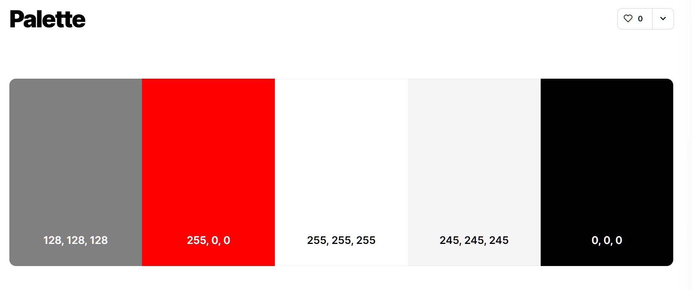
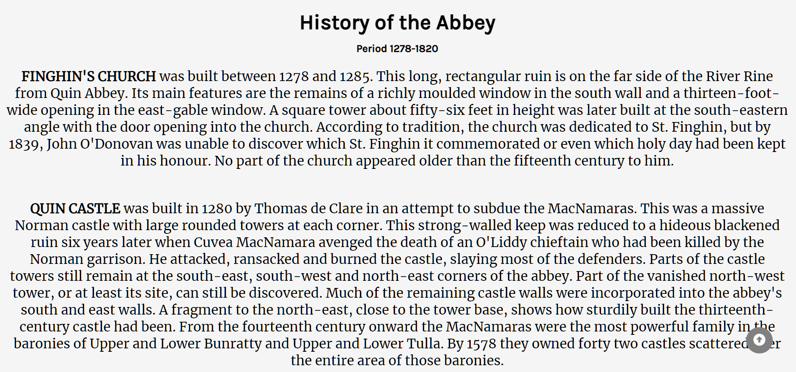
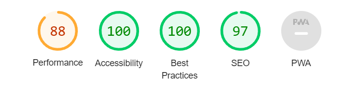

# The Quin Abbey 
**The Quin Abbey** is a old Friary in Quin Village County Clare. I have picked this location because of its history and made a responsive website for it where you can see a 360 video of the Abbey on the home page and there is an about page with history, facts and myths of the Abbey. I have also added a gallery with many photos of the outside and inside of the Abbey. On the contact page it has opening times, the location and a form to book a tour guide.

 [View the Quin Abbey live website on Github pages](https://dylanp400.github.io/Quin-abby/index.html)

___ 

# Contents
* [User Experience](#user-experience)
  * [Initial Discussion](#initial-discussion)
  * [User Stories](#user-stories)

* [Design](#design)
  * [Colour Scheme](#colour-scheme)
  * [Typography](#typography)
  * [Imagery](#imagery)
  * [Wireframes](#wireframes)

* [Features](#features)
  * [General features on each page](#general-features-on-each-page)

* [Technologies Used](#technologies-used)
  * [Languages Used](#languages-used)
  * [Frameworks, Libraries & Programs Used](#frameworks-libraries--programs-used)

* [Testing](#testing)
  * [Lighthouse](#lighthouse)
  * [Bugs](#bugs) 

* [Accessibility](#accessibility)

* [Deployment](#deployment)
  * [Local deplyoment](#local-deployment)

* [Credits](#credits)

  * [Code Used](#code-used)
  * [Content](#content)
  * [Media](#media)
  * [Acknowledgments](#acknowledgments)  

___

# User Experience

## Initial Discussion
The Quin Abbey is a Historic location in Quin County Clare. People can come and see the Abbey all year round.

### Key information for this site
* Where you can find the location of the Abbey
* A 360 ariel view of the Abbey
* A gallery with 20+ photos
* A sign up form for a tour guide
* Location and opening Times

## User Stories

### Client goals
* To see the Abbey immediately when you open the site.
* For the site to be responsive on PC, phones and tablets.
* To see the Abbey's location and how to get there.
* To be able to contact and sign up for a tour guide.
* To see photos of the Abbey before arrive. 

# Design

## Colour Scheme

 
 The primary colour is grey (rbg 128, 128, 128,) it is on the background of the about page and the gallery page. I picked grey because although it is a tourist attraction and a historic site, it is also a graveyard and I wanted to be respectful while making the site.
 
 I used whitesmoke (rgb 255, 255, 255) for the links in the nav.
  
 I used red (rgb 255, 0, 0,) for the hover effect on the nav, footer, phone number link and the email link.
   
 I used white (rgb 245, 245, 245) for the footer icons. I used black for the main content on the about page, footer headings and the border and shadow around the images in the gallery.

## Typography 
  I used [Google Fonts](https://fonts.google.com/) to import the following fonts to the site

* The 'Libre Baskerville' font is used on the logo for the site.
   * 

* The 'Karla' font is used for all headlings like the Footer, About page, Form and the Form Confirmation page.
   * I also used 'Karla' for the paragraphs in the sign up form.
   * 

* The 'Merriweather' font is used for the Nav, Home page information, About page paragraphs, Confirmation page paragraphs, and the Form label.
   * 

* The 'Satisfy' font is used for the Opening times and Contact information.
   *    

## Imagery
All images were taken by myself.
The 360 ariel video was found on youtube and I edited it to take the sound off and make it shorter to fit into the background.

## Wireframes
* This a wireframe of my Home page.
  * 

* This a wireframe of my About page.
  * 

* This a wireframe of my Gallery page.  
  * 

* This a wireframe of my Contact page.  
  * 

* These are quick wireframes I made using paint at the very start of my project.  
  * 
  * 
  * 

# Features

## General features on each page

* Navigation bar 
   * Featured on all five pages, the navigation bar is fully responsive and includes links to the Home, About, Gallery, Contact and the Form confirmation page.

   * This section will allow the user to easily navigate from page to page across all devices without having to revert back to the previous page via the ‘home’ button.

     * 

   * When you hover over the nav links they will turn red and It has a white line underneath to show which page you are currently on.

     *  

* Home page Video 
   * The Home page has a video of the Abbey taken from a drone as a background video, it shows every part of the Abbey from the sky.

     * 

* Home page information.

     * 

* Desktop view.

     * 

* Mobile view.

     * 

* About page. 
  * The About page has all the information of the Abbey through out the years like owners and restorations.

     * 
   

  * I have also inculded Myths and Tales that surround the Abbey.

     * 

*  Desktop view.

     * 

*  Mobile view.

     * 

* Gallery.
  * For the Gallery I went out to the Quin Abbey and took some photos myself. I got many photos of the Abbey but decided to use 20+ photos for my 
   gallery.

  * Desktop view.

     * 

  * Tablet view.  

     * 

  * Mobile view.  

     * 
  

* Contact Page. 
  * On the Contact page you can see the Opening Times and Contact information of the Abbey.
    * 

  * The Contact information also has a red hover effect.

    *   

  * You can sign up for a tour guide of the Abbey.
    * 
    * 
  
  * The location is at the bottom underneath the form.
    * 

* Desktop view.

    * 

* Mobile view.

    * 

* Form sign up confirmation page.

  * Once you click submit on the form, a new tab will open with a page explaining you have signed up for a tour guide and that the Abbey will contact you by email for a tour guide
  
    * 

* Desktop view.

    * 

* Mobile view.

    * 

* Footer.

  * The footer has the name of the Abbey and links for social media and I have supplied links to my very own Github account and Linkedin.

    * 

    * 
    
  * The footer has the same hover effect as my nav.

    *  

* Back to top button.

  * The About, Gallery and Contact pages have a button to bring you back up to the top of the page. I left this feature out of the Home page and Form confirmation page because you can only scroll a small bit.

    * 

* Favicon.
  
  * I used one of the photos I took for the Favicon for the Abbey website.
   
   * 

# Technologies Used

 ## languages used
   * HTML and CSS were used to create this website.

 ## Frameworks, Libraries & Programs Used
   * [Balsamiq](https://balsamiq.com/) - Used to create wireframes.
   * [Paint](https://apps.microsoft.com/store/detail/paint/9PCFS5B6T72H?hl=en-us&gl=us) - Used to create wireframes.
   * [Git](https://git-scm.com/) - For version Control.
   * [Github](https://github.com/) - Used to save amd store the files for the website. 
   * [Gitpod](https://www.gitpod.io/) - Was used to created my code.
   * [Google Fonts](https://fonts.google.com/) - Used to import the fonts used on the website.
   * [Font awesome](https://fontawesome.com/) - For the iconography on the website.
   * [Google Dev Tools](https://developer.chrome.com/docs/devtools/) - To troubleshoot and test features, solve issues with responsiveness and styling.
   * [Tiny PNG](https://tinypng.com/) - used to compress Images. 
   * [ILOVEIMG](https://www.iloveimg.com/) - Used to resize Images.
   * [AM I Resposnsive?](https://amiresponsive.co.uk/) - Used to show the Website image on a range of devices.
   * [Youtube](https://www.youtube.com/) - For the video on the home page.
   * [Shields](https://shields.io/) - For the buttons at the top of my Readme.
   * [Favicon](https://www.favicon-generator.org/) - Used to make a Favicon for the website.
   * [Coolors](https://coolors.co/808080-ff0000-ffffff-f5f5f5-000000) - For my colour scheme.

# Testing
 * No errros were found using the [w3c html validator](https://validator.w3.org/nu/)
   * Index 

   * About 

   * Gallery 

   * Contact 

   * Form confirmation 

 * No errors were found using the [w3c CSS jigsaw](https://jigsaw.w3.org/css-validator/).
   * CSS 
   * 

 ## Unfixed bugs

   * In the nav the white underline is too long and I was unable to fix it.
   * On my personal phone the date and time input on the contact page is not centered. 
   * The background video is blurry on mobile view.
   * on the Firefox browser the button to submit for the form says submit query instead of submit.

 ## Lighthouse
 * Home page desktop.

   * 

 * Home page mobile. 

   * 

 * About page desktop.

   * 

 * About page mobile.

   *   

 * Gallery page desktop.

   * 

 * Gallery page mobile.

   *     

 * Contact page desktop.
 
   * 

* Contact page mobile.

   * 

* Form confirmation page desktop.

   * 

* Form confirmation page mobile.

   * 

# Accessibility 

  * I used semantic HTML for the website.
  * I used alt attributes on all images.
  * The colour contrast is easy to read.
  * I used aria-labels on all links.
  

# Deployment
 
I Deployed the site on Github Pages - [The Quin Abbey](https://dylanp400.github.io/Quin-abby/index.html).

To Depoy a Website using Github Pages you need too.

1. Login (or signup) to Github.
2. Go to the repository for this project, [DylanP400/Quin-abby](https://github.com/DylanP400/Quin-abby)
3. Click the settings button.
4. Select pages in the left hand navigation menu.
5. From the source dropdown select main branch and press save.
6. The site has been deployed, the site will take a few minutes to be up and running.

## Local Deployment

### How to Fork
To fork the repository:
1. Log in to Github.
2. Go to the repository for this project, [DylanP400/Quin-abby](https://github.com/DylanP400/Quin-abby)
3. Click the Fork button in the top right corner.

### How to clone 
To clone the repository:

1. Log in to GitHub.
2. Go to the repository for this project, [DylanP400/Quin-abby](https://github.com/DylanP400/Quin-abby)
3. Click on the code button, select whether you would like to clone with HTTPS, SSH or GitHub CLI and copy the link shown.
4. Open the terminal in your code editor and change the current working directory to the location you want to use for the cloned directory.
5. Type 'git clone' into the terminal and then paste the link you copied in step 3. Press enter.

# Credits

## Code Used
  * For my Gallery I found a grid system on [W3 Schools gallery image grid](https://www.w3schools.com/howto/howto_css_image_grid_responsive.asp).

  * For my form I used [Web Dev Simplified](https://www.youtube.com/watch?v=nLxA9froMOs) video on how to make form. I was not happy with it and the tips and style I got from Web Dev made it look a lot nicer on my page.

  * I learned how to insert a video into the background from [Web Dev Simplified](https://www.youtube.com/watch?v=y9ITxSzjZUc&list=PLQ3vyzwXGsgJnHHoW2Y_JgheqF4o9HMfR&index=17&t=466s). I had my video linked with a Iframe on my page but having it in the background looks a lot nicer.

  * For the button that brings you back to the top of the page I followed a video from [Dark Code](https://www.youtube.com/watch?v=Vef9bxTilCU&t=11s).

## Content
 * I learned how to use flex box from three sources.
   * [The Odin Project](https://www.theodinproject.com/).
   * [Kevin Powell](https://www.youtube.com/@KevinPowell).
   * [Web Dev simplified](https://www.youtube.com/@WebDevSimplified).

 * All information in my About page was taken from the [Clare County Libary](https://www.clarelibrary.ie/eolas/coclare/places/quininterest.htm).

 * I learned how to make a header and footer from two sources.
   * [Kevin Powell](https://www.youtube.com/@KevinPowell).
   * [Web Dev simplified](https://www.youtube.com/@WebDevSimplified).

 * I have to give a huge thank you to [Kera](https://github.com/kera-cudmore) for the template of the README and all the tips that came with it.
    

## Media
 * All photos have been taken and edited by myself.
 * I got the video on the home page off youtube I could not email the owner to ask for permission but I left a comment underneath asking for permission. [Orignal video](https://www.youtube.com/watch?v=6EgQBH_0Ppc).

 ## Acknowledgments
 * I would like to thank my mentor [Rory](https://github.com/Ri-Dearg) for all the help and advice through out the Project.
 * I would like to thank the Tutor support system for helping me when I was stuck or unsure.
 * I would like to thank every student on slack that helped me with problems and explained my errors to me.